# 2025年GoGoLLM最新迭代

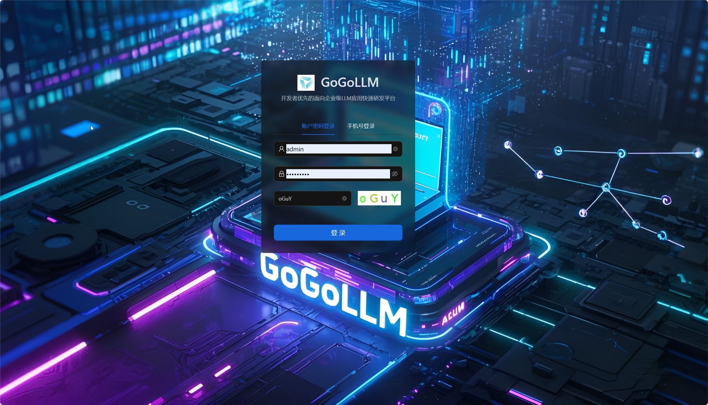

我们在2025年对GoGoLLM进行了全面迭代优化，目前已在企业级大规模生产环境中运行（应用于多个垂直领域业务）。
具体迭代优化点如下：

## 1. 迭代优化自然语言搜索解决方案
迭代优化大模型+ElasticSearch自然语言搜索解决方案，进一步抽象，适配大多数公司ElasticSearch搜索场景，可实现大模型AI搜索快速集成垂直领域搜索业务，以天为单位。
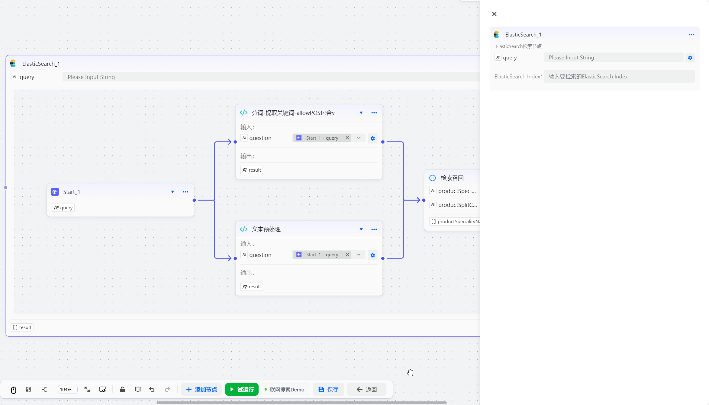

## 2. 迭代优化工作流可视化编排
工作流可视化编排迭代升级，支持更友好、高效的拖拽式配置；输入和输出配置更灵活，支持并行、分支、human-in-loop、循环、批处理等;测试运行可视化展示，方便开发者快速调试；对于大模型-单智能体集成了企业级最佳实践，更可控的智能体编排：工具调用循环次数完全可控、支持主流的大模型厂商（阿里通义大模型、DeepSeek、火山引擎-豆包大模型、OpenAI等），并对阿里云系列等大模型做了结构化输出、深度思考的定制化集成。

最新工作流演示，以联网搜索智能体为例：

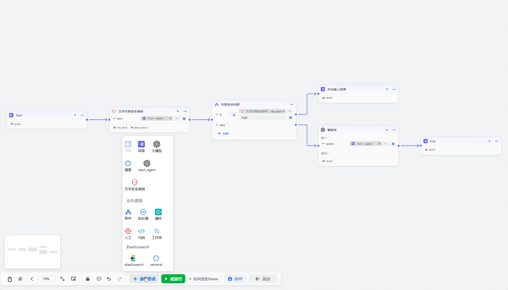

此工作流集成了文本内容安全审核，确保大模型回答的内容符合企业级安全规范。
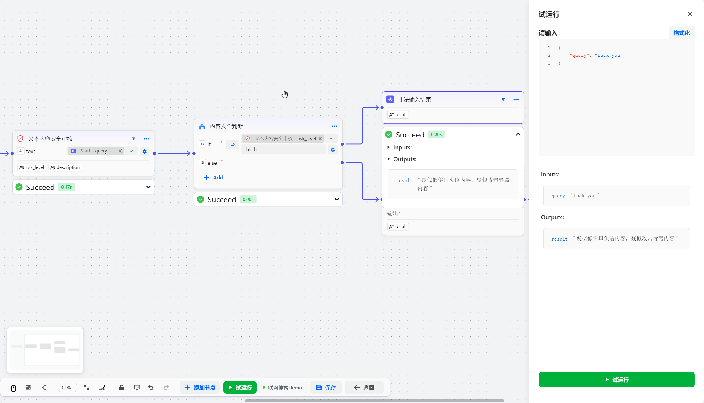

大模型节点运行流程全透明，可视化点击查看输入和输出，以及工具调用迭代次数和调用结果。

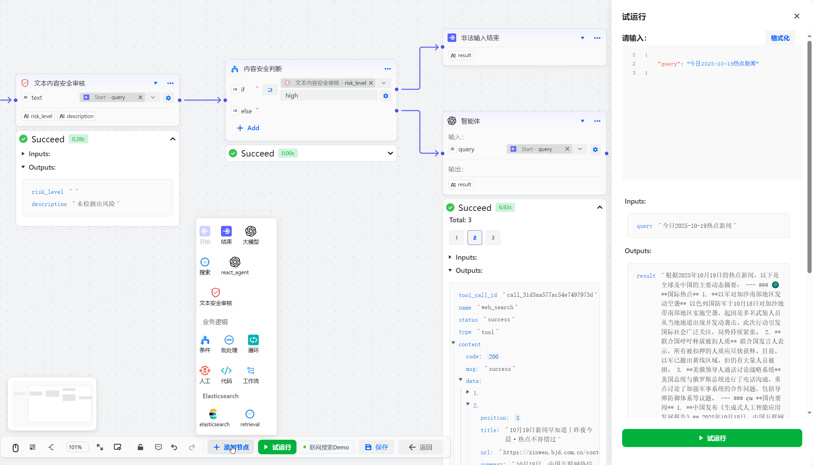

## 3. gogollm-code-sandbox
集成自研的代码执行沙盒：gogollm-code-sandbox，支持单机大量并发执行。

## 4. gogollm-reader
基于JinaAI Reader开源项目集成和优化实现gogollm-reader，可实现大模型对互联网网页详情内容读取，提升大模型回答内容的质量和数据丰富度。

## 5. 支持MCP集成
支持MCP集成。可集成市面上任何支持SSE协议的MCP 工具。极大方便大模型应用数据和工具集成。
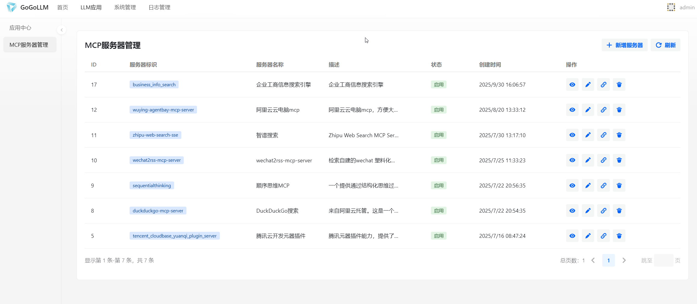

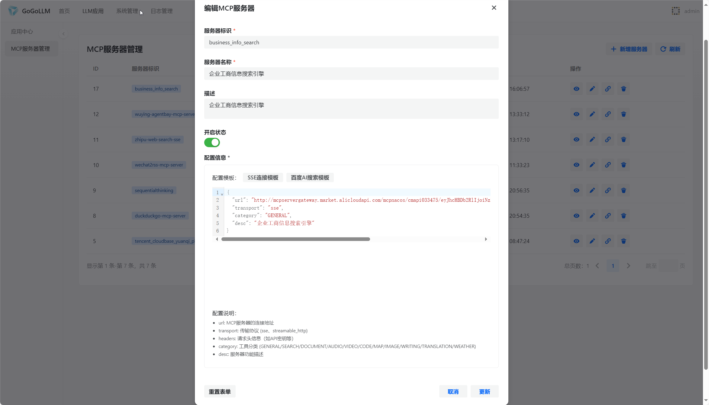

> 目前GoGoLLM支持3类工具集成，分别是：
> 1. 本地代码研发集成的工具
> 2. 远程MCP工具
> 3. 编排的工作流作为工具，基于此功能可方便实现类似的多智能体协作，实现复杂的业务编排场景（本质是分治思想）。

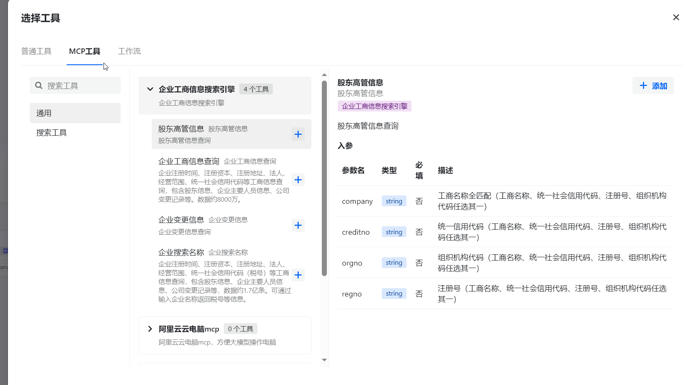

支持市场上所有SSE协议的MCP工具，如魔搭MCP市场：
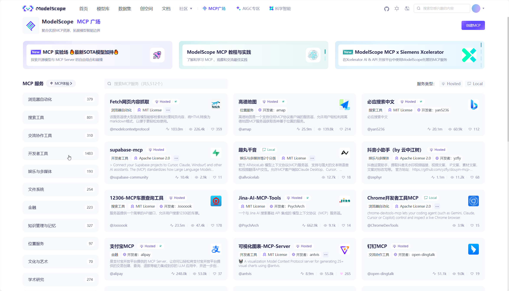

## 6. 后端架构重构
后端架构重构，基于大模型应用最先进的LangGraph框架实现，基于大型开源项目有保障，可扩展、可维护。

## 7. 实现可观测平台集成
实现可观测平台集成,可观测平台存储层基于大数据ClickHouse,可实现秒级内统计大量业务运行指标;基于可观测平台业非常方便实现 定性+定量的评估机制（具体实现可联系团队了解）;可实现提示词多版本管理；可视化追踪观察内部运行流程、每次运行成本等；

主页统计分析：
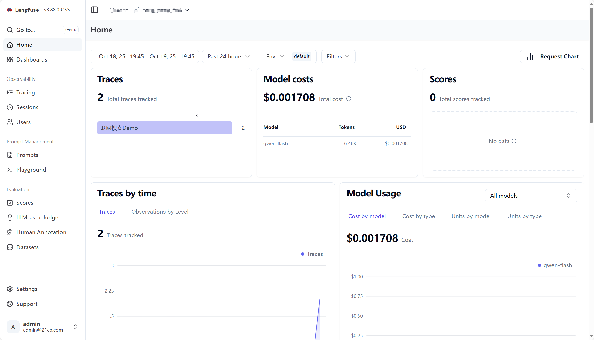

观察调用成本：
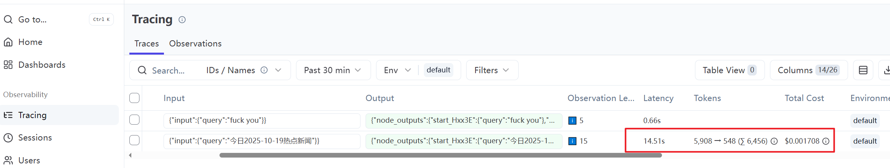

观察运行流程：
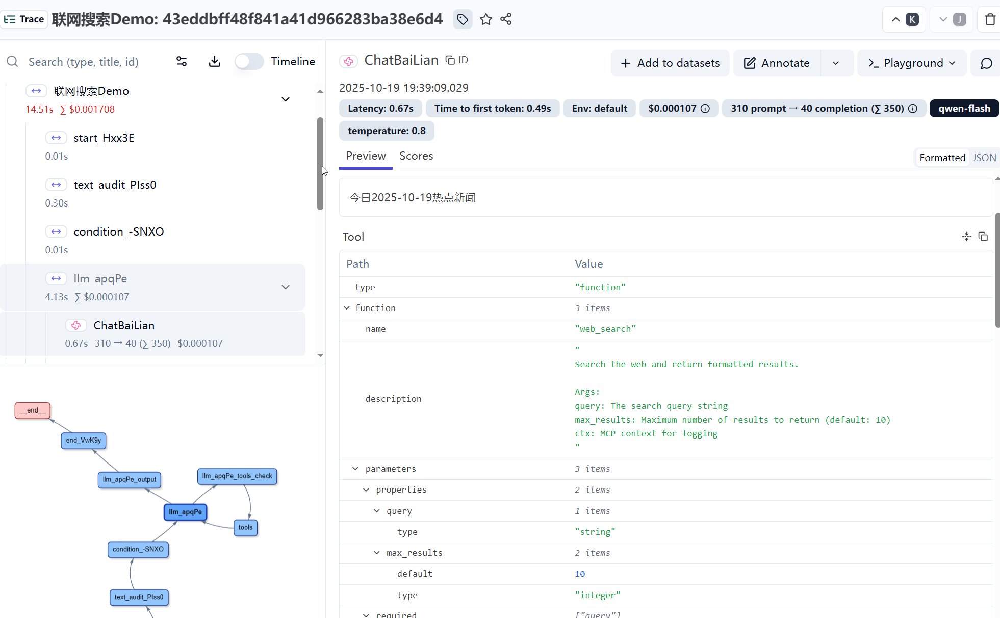

## 8. 可无缝集成Higress AI网关
可无缝集成Higress AI网关，实现大模型应用的高可用、高并发。
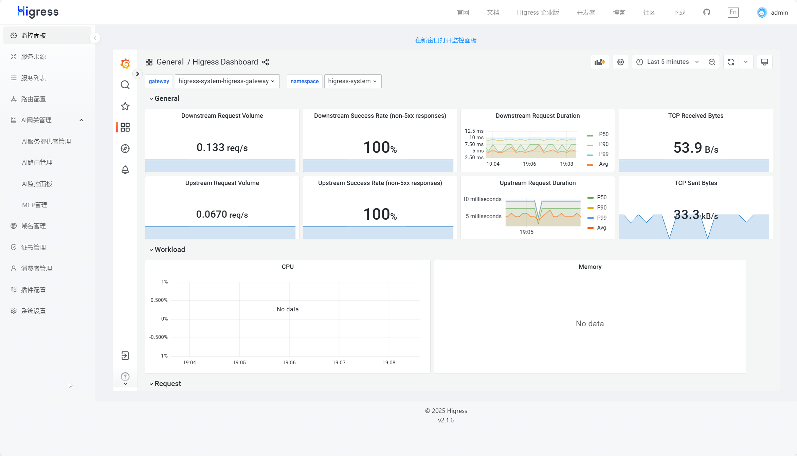

## 9. 权限管理完善
权限管理完善，粒度更细，支持用户、角色、权限的管理。并实现操作审计功能，记录用户对平台的所有操作，方便后续的安全分析和审计。

## 10. 2025最新平台架构简图

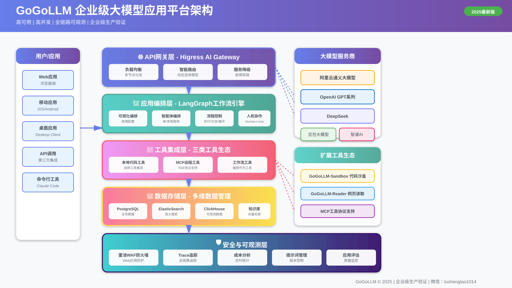

## 更多联系
......更多功能详情介绍以及企业级解决方案，可联系微信：

tushengtao1014

